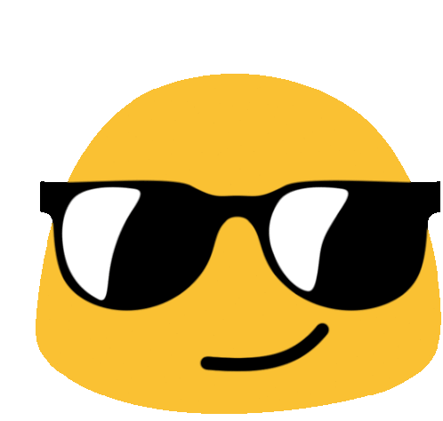

<h1 align="center">
   
  Hello! I'm Kauan Fonseca! 
  
</h1>

<h4 align="center">Junior Developer</h4>

 

### 🛠️ Backend 
My area of specialty.

  

### ☁️ Infrastructure
My current area of focus and deep learning.

  

### 🎨 Frontend 
Technologies I am familiar with and have used in projects.

  

 

  
  

 

 
  

